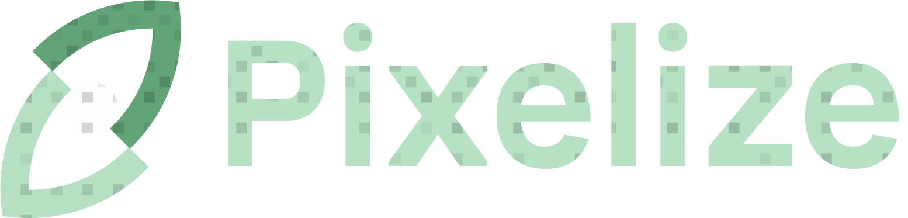
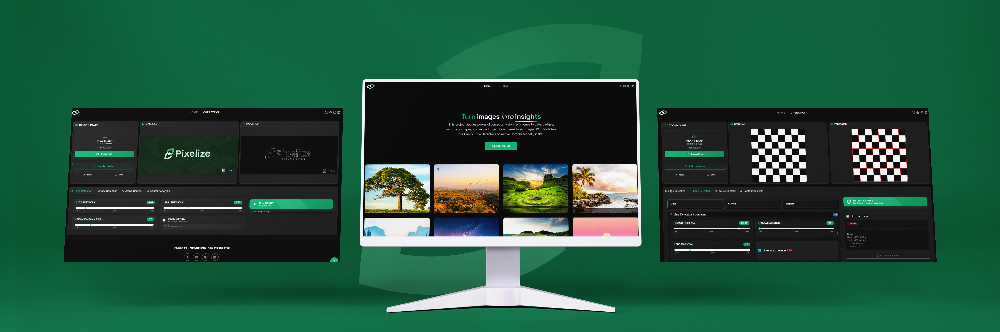
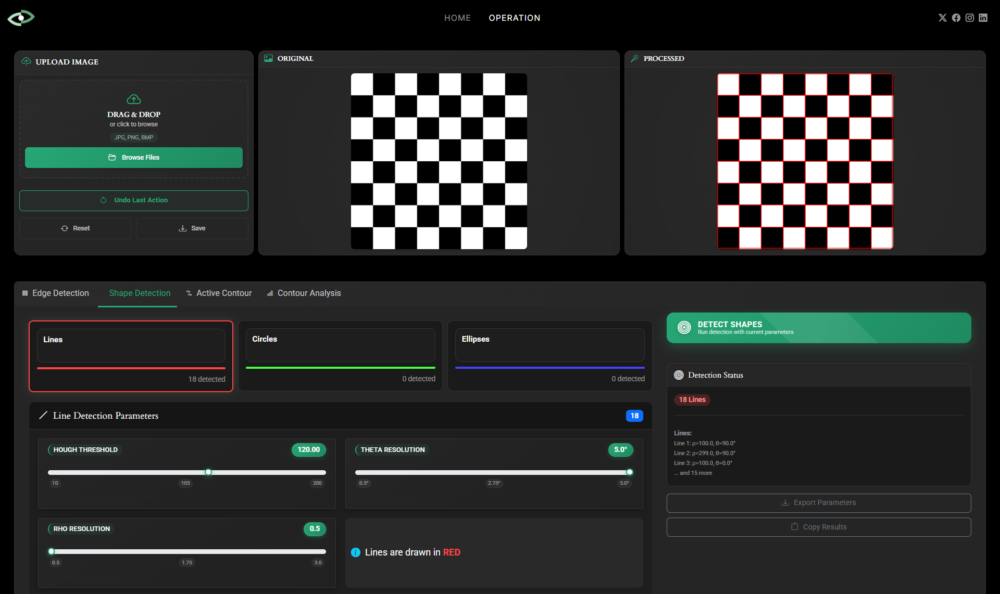
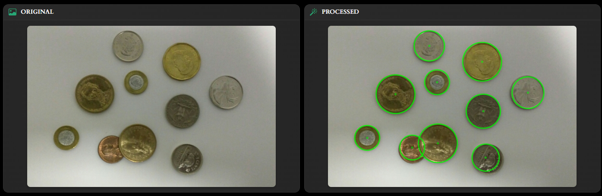
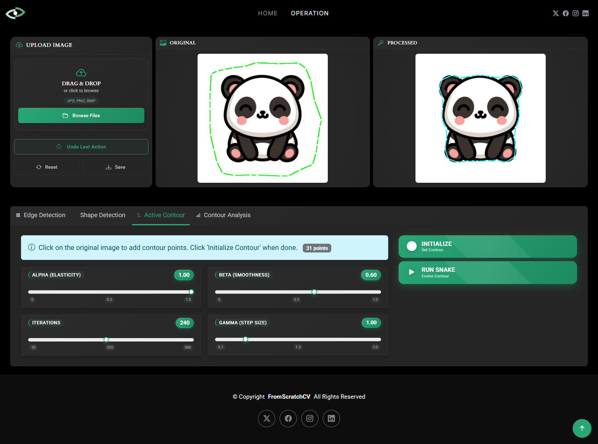
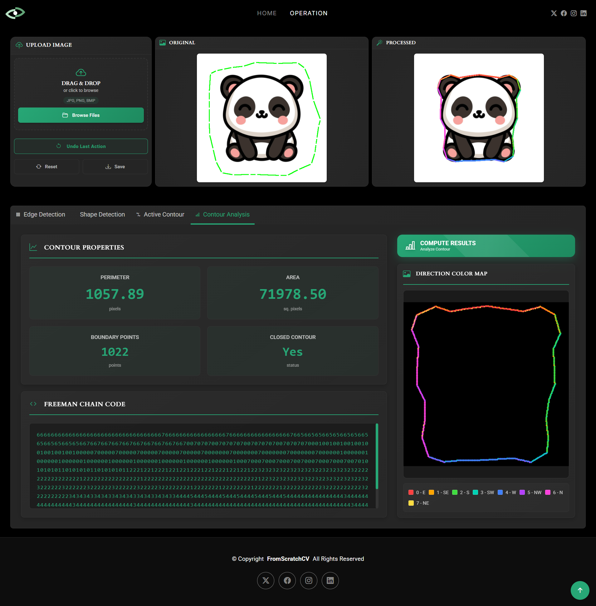

<p align="center">
  
</p>

<h1 align="center">FromScratchCV</h1>

<p align="center">
  <b>Computer Vision Algorithms — Built from Scratch in C++</b><br/>
  No OpenCV. No scikit-image. Pure mathematics.
</p>

<p align="center">
  
</p>

<p align="center">
  
  
  
  
</p>

---

##  Table of Contents

- [Overview](#-overview)
- [Architecture](#-architecture)
- [Features](#-features)
  - [ Canny Edge Detection](#-canny-edge-detection)
  - [ Shape Detection](#-shape-detection)
    - [Hough Lines](#hough-lines)
    - [Hough Circles](#hough-circles)
    - [Ellipse Detection](#ellipse-detection)
  - [Active Contour (Snake)](#-active-contour-snake)
  - [Contour Analysis](#-contour-analysis)
- [Project Structure](#-project-structure)
- [Getting Started](#-getting-started)
  - [Prerequisites](#prerequisites)
  - [Build with CMake](#build-with-cmake)
  - [Build Manually (GCC/MinGW)](#build-manually-gccmingw)
  - [Run the Application](#run-the-application)
- [Algorithm References](#-algorithm-references)

---

## Overview

**FromScratchCV** is a complete computer vision web application where every algorithm is implemented entirely from scratch in **C++17** — no OpenCV, no image processing libraries.

The backend is a single-process C++ HTTP server (using `cpp-httplib`) that handles image uploads, runs the algorithms, and returns results as JSON (with base64-encoded images). The frontend is a modern, dark-themed HTML/CSS/JavaScript interface that visualizes all results directly in the browser on an HTML5 Canvas.

This project covers **Task 2** requirements:
- Edge detection with Canny
- Shape detection (Lines, Circles, Ellipses)
- Active contour evolution (Greedy Snake Algorithm)
- Contour analysis with Freeman Chain Code

---

## Architecture

```
FromScratchCV/
├── backend/                    ← C++ HTTP server
│   ├── main.cpp                ← All REST API endpoints
│   ├── CMakeLists.txt
│   ├── algorithms/
│   │   ├── image_utils.*       ← Image I/O, GrayImage, RGBImage, PNG encode/decode
│   │   ├── edge_detection.*    ← Gaussian blur, Sobel, Canny
│   │   ├── shape_detection.*   ← Hough Lines, Hough Circles, Ellipse Fit
│   │   ├── active_contour.*    ← Greedy Snake (Active Contour)
│   │   └── contour_analysis.*  ← Freeman Chain Code, Perimeter, Area
│   └── include/
│       ├── httplib.h           ← Single-header C++ HTTP server
│       └── json.hpp            ← nlohmann/json
│
├── Frontend/
│   ├── index.html              ← Landing page
│   ├── operation.html          ← Main application UI (tabbed interface)
│   └── assets/
│       ├── css/
│       │   ├── main.css
│       │   └── operation.css
│       └── js/
│           ├── main.js
│           └── operation.js    ← All frontend logic, canvas drawing, API calls
│
├── UI_output/                  ← Sample output screenshots
├── run.bat                     ← One-click build + run (Windows, CMake)
└── README.md
```

**Request Flow:**
```
Browser → operation.js → HTTP POST → C++ server (port 8000)
                                       ↓
                                  Algorithm runs
                                       ↓
                              JSON response (base64 image + data)
                                       ↓
Browser Canvas ← operation.js renders shapes on image ←
```

---

## Features

### Canny Edge Detection

A full, multi-step implementation of the classic Canny edge detector:

| Step | Implementation |
|---|---|
| 1. Gaussian Blur | Separable 1D kernel convolution, configurable sigma |
| 2. Sobel Gradient | Horizontal + vertical gradient kernels |
| 3. Non-Max Suppression | Sub-pixel edge thinning along gradient direction |
| 4. Hysteresis Thresholding | Dual-threshold with 8-neighbor connectivity walk |

**Parameters:** `sigma`, `low_threshold`, `high_threshold`

**Output:** Binary edge image overlaid on original, configurable blend.

> **Screenshot Placeholder**
> 
> 
> 
> *Replace with: `UI_output/canny_output.png`*

---

### Shape Detection

All three shape detectors run a fresh Canny pass (with σ=1.4 for better edge quality) before detection and return the detected shape coordinates as JSON alongside the annotated image.

#### Hough Lines

Standard Hough Transform accumulator in (ρ, θ) space:

- **Accumulator:** 2D array indexed by (rho, theta)
- **NMS:** 5×5 local-maximum suppression in accumulator space to eliminate clustered peaks
- **Sorted output:** Lines returned in descending vote order
- **Overlay:** Drawn as infinite red lines across the full image

**Parameters:** `threshold` (minimum votes), `theta_res` (degrees), `rho_res` (pixels)

<p align="center">
  
</p>
<p align="center"><i>Hough Lines — detected lines overlaid in red</i></p>

---

#### Hough Circles

Standard Hough Circle Transform with crucial improvements over a naïve implementation:

| Fix | Description |
|---|---|
| **Border exclusion** | Image boundary pixels are excluded from voting — prevents border artifacts from inflating the threshold |
| **Absolute threshold** | `votes ≥ threshold × 2πr` (circumference-based), not relative to per-radius max (which is biased by noise) |
| **360-angle voting** | Every 2° (180 samples) for fine-grained accumulation |
| **3×3 NMS** | Per-cell local maximum check before accepting a center |
| **Duplicate merge** | Centers within `min(r1, r2)` pixels and radii within 30% are merged |

**Parameters:** `radius_min`, `radius_max`, `threshold` (default 0.55), `min_abs_votes` (hard floor)

<p align="center">
  
</p>
<p align="center"><i>Hough Circles — detected circles overlaid in green</i></p>

---

#### Ellipse Detection

> **Work in Progress** — This section will be completed once the ellipse detection algorithm is finalized.

*Ellipse detection results and documentation will be added here.*

---

### Active Contour (Snake)

Implementation of the **Greedy Snake Algorithm** (Williams & Shah, 1992):

**Energy function:**

$$E_{total} = \alpha \cdot E_{cont} + \beta \cdot E_{curv} + \gamma \cdot E_{ext}$$

| Term | Description |
|---|---|
| **E_cont** (Continuity) | Penalizes spacing deviation from average inter-point distance — keeps snake evenly distributed |
| **E_curv** (Curvature) | Second-difference of adjacent points — controls smoothness |
| **E_ext** (External) | Negative gradient magnitude field — attracts snake toward strong edges |

**Implementation details:**
- External energy field is a **Gaussian-blurred gradient magnitude** (σ=3.0, kernel=15) — allows snake to "feel" edges from further away
- Grid search in a **7×7 window** around each point per iteration
- Energy terms are **normalized by average spacing** so α/β/γ weights are directly comparable
- Convergence stops when max point displacement < 0.5 pixels
- Returns **full evolution history** (all intermediate states)

**Parameters:** `alpha` (elasticity), `beta` (smoothness), `gamma` (edge attraction), `iterations`

<p align="center">
  
</p>
<p align="center"><i>Active Contour — snake evolved to fit the object boundary</i></p>

---

### Contour Analysis

Analyzes the detected snake contour using **Freeman Chain Code** (8-directional):

| Metric | Method |
|---|---|
| **Chain Code** | 8-directional boundary tracing using CCW priority rotation |
| **Perimeter** | Sum of chain steps: 1.0 for cardinal, √2 ≈ 1.414 for diagonal |
| **Area** | Shoelace formula (Gauss's area theorem) on boundary coordinates |
| **Closure** | Checks if start ≈ end (within 2px) |
| **Visualization** | Each direction coded with a distinct color (8 colors) |

**Two visualization modes:**
1. **Overlay** — Freeman code colors drawn on top of original image
2. **Code Image** — Contour on black background, auto-scaled to fill canvas

**Direction Color Legend:**

| Code | Direction | Color |
|---|---|---|
| 0 | East (→) | Red |
| 1 | South-East (↘) | Orange |
| 2 | South (↓) | Green |
| 3 | South-West (↙) | Teal |
| 4 | West (←) | Blue |
| 5 | North-West (↖) | Purple |
| 6 | North (↑) | Pink |
| 7 | North-East (↗) | Yellow |

<p align="center">
  
</p>
<p align="center"><i>Freeman Chain Code visualization — each direction segment colored distinctly</i></p>

---

## Project Structure

```
backend/algorithms/
├── image_utils.h/.cpp      ← RGBImage, GrayImage structs, PNG encode/decode (stb_image)
├── edge_detection.h/.cpp   ← gaussian_blur(), sobel(), canny()
├── shape_detection.h/.cpp  ← hough_lines(), hough_circles(), detect_ellipses(), overlay_*()
├── active_contour.h/.cpp   ← Snake struct: init(), setPoints(), evolve(), reset()
└── contour_analysis.h/.cpp ← analyze_contour(), render_freeman_overlay(), render_freeman_code_image()
```

---

## Getting Started

### Prerequisites

| Requirement | Notes |
|---|---|
| C++17 compiler | GCC 9+, MinGW-w64, or MSVC 2019+ |
| CMake 3.14+ | For CMake build |
| Python 3 | For the frontend static file server |
| A modern browser | Chrome, Firefox, or Edge |

The backend has **zero external runtime dependencies** — `httplib.h` and `json.hpp` are both single-header libraries bundled in `backend/include/`.

---

### Build with CMake

```bash
# From the project root
cd backend
mkdir build && cd build
cmake ..
cmake --build .
```

Or on Windows, just double-click **`run.bat`** at the project root.

---

### Build Manually (GCC/MinGW)

```bash
cd backend

g++ -std=c++17 -O2 -Iinclude -I. -o server.exe \
    main.cpp \
    algorithms/image_utils.cpp \
    algorithms/edge_detection.cpp \
    algorithms/shape_detection.cpp \
    algorithms/active_contour.cpp \
    algorithms/contour_analysis.cpp \
    -lws2_32
```

---

### Run the Application

**Step 1 — Start the C++ backend server:**
```bash
cd backend
.\server.exe          # Windows
./server              # Linux/Mac
```
Server listens on **`http://localhost:8000`**

**Step 2 — Serve the frontend:**
```bash
# From the project root
python -m http.server 8080
```

**Step 3 — Open the app:**

Navigate to **`http://localhost:8080/Frontend/operation.html`**

---


## Algorithm References

1. **Canny Edge Detector** — Canny, J., *"A Computational Approach to Edge Detection"*, IEEE Trans. Pattern Analysis and Machine Intelligence, 1986.
2. **Hough Line Transform** — Duda, R. O. and Hart, P. E., *"Use of the Hough Transformation to Detect Lines and Curves in Pictures"*, Comm. ACM, 1972.
3. **Hough Circle Transform** — Kimme, C., Ballard, D., and Sklansky, J., *"Finding Circles by an Array of Accumulators"*, Comm. ACM, 1975.
4. **Ellipse Fitting** — Fitzgibbon, A. W., Pilu, M., and Fisher, R. B., *"Direct Least Square Fitting of Ellipses"*, IEEE PAMI, 1999.
5. **Greedy Snake** — Williams, D. J. and Shah, M., *"A Fast Algorithm for Active Contours and Curvature Estimation"*, CVGIP: Image Understanding, 1992.
6. **Freeman Chain Code** — Freeman, H., *"On the Encoding of Arbitrary Geometric Configurations"*, IRE Transactions on Electronic Computers, 1961.

---

